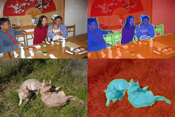
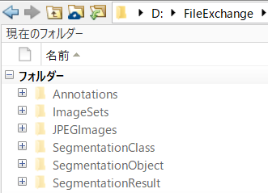
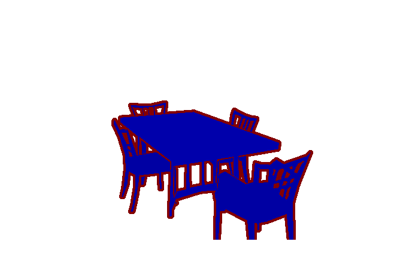
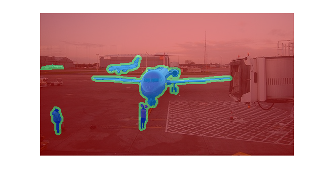
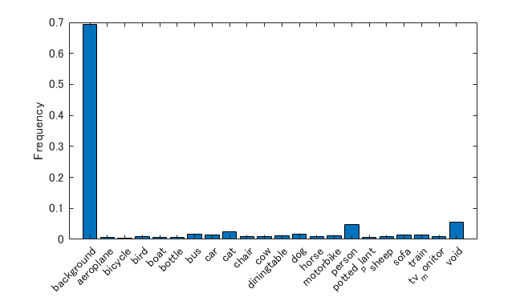
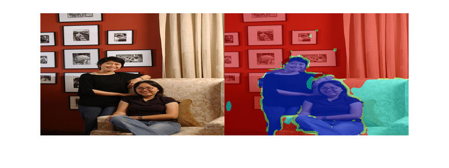
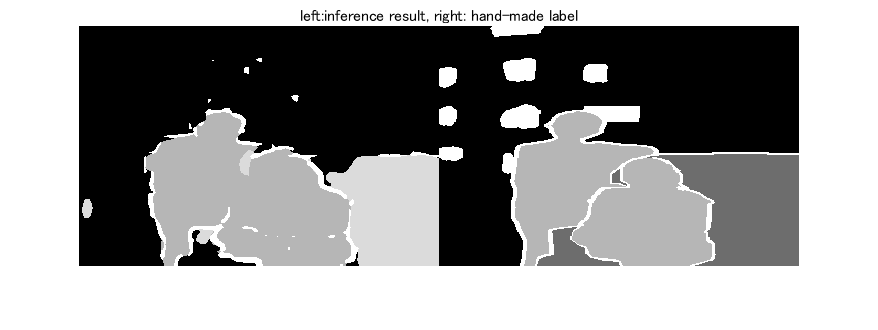
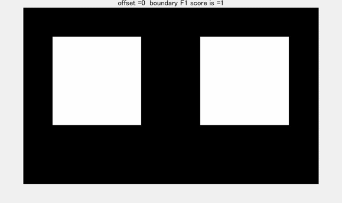

[](https://jp.mathworks.com/matlabcentral/fileexchange/75938-semantic-segmentation-using-pascal-voc)
# Semantic Segmentation Using Pascal-VOC dataset
**[English]**  
This example shows how to train a semantic segmentation network using deep learning. This example was a modified version of the Matlab official document entitled [Semantic Segmentation Using Deep Learning](https://jp.mathworks.com/help/vision/examples/semantic-segmentation-using-deep-learning.html) [1]. A semantic segmentation network classifies every pixel in an image, resulting in an image that is segmented by class as shown below.  
**[Japanese]**  
この例ではPascal VOCデータセットを用いてセマンティックセグメンテーションを行う例を示します。セマンティックセグメンテーションでは、画像の「塗り絵」のようなことを行い、その領域がどのような物体かを推定します。この例はMATLAB公式ドキュメント [1]をもとに作成しています。下の動画は今回のセグメンテーションの結果の例を示しています。



To illustrate the training procedure, this example trains Deeplab v3+ [2], one type of convolutional neural network (CNN) designed for semantic image segmentation. This example uses the dataset in [Visual Object Classes Challenge 2012 (VOC2012)](http://host.robots.ox.ac.uk/pascal/VOC/voc2012/index.html) [3]. To run this code, please down load the dataset available at  [3]. 

[1]  [Semantic Segmentation Using Deep Learning](https://jp.mathworks.com/help/vision/examples/semantic-segmentation-using-deep-learning.html)

[2] Chen, Liang-Chieh et al. “Encoder-Decoder with Atrous Separable Convolution for Semantic Image Segmentation.” ECCV (2018).

[3]  [Visual Object Classes Challenge 2012 (VOC2012)](http://host.robots.ox.ac.uk/pascal/VOC/voc2012/index.html)

# Load Pascal-VOC Pixel-Labeled Images

Please run this code after down-loading the Pascal-VOC data from [2]. Unzip and change the directly as shown below. The down-loaded data can be unfrozen into the folders as shown below. The annotated labels were stored in the folder of SegmentationClass. The pixel values in the png images in the Segmentation Class folder corresponds to class ID. Each class ID represents each class. 

Use [`pixelLabelDatastore`](docid:vision_ref.mw_c2246553-ba4a-4bad-aad4-6ab8fa2f7f2d) to load CamVid pixel label image data. A `pixelLabelDatastore` encapsulates the pixel label data and the label ID to a class name mapping. Use the classes and label IDs to create the `pixelLabelDatastore.`



```matlab:Code
clear;clc;close all
```

The labeled images are stored in `SegmentationClass` folder with `png` format. 

```matlab:Code
labeledImg=imread('./SegmentationClass/2007_003251.png');
```

The edges have the intensity of 255 while each object ID is like 3, 5, 10. Just using imshow does not depict the labeled image well. Use `label2rgb` function to convert label matrix into RGB image. 

```matlab:Code
RGB= label2rgb(labeledImg);
figure;imshow(RGB)
```



# Create datastore for images and labels

```matlab:Code
classes={'background','aeroplane','bicycle','bird','boat','bottle','bus','car','cat','chair','cow','diningtable','dog', ...
    'horse','motorbike','person','potted_plant','sheep','sofa','train','tv_monitor','void'};
labelIDs=[0:20,255];
pxds = pixelLabelDatastore('SegmentationClass',classes,labelIDs);
```

The RGB image was stored in `SegmentationClass` folder. The label image and its RGB image can be linked as follows and store the RGB image into image datastore. 

```matlab:Code
imgAddress=strcat(extractBefore(pxds.Files,'SegmentationClass'),'JPEGImages',extractBetween(pxds.Files,'SegmentationClass','png'),'jpg');
imds=imageDatastore(imgAddress);
```

# Display one example

Read and display one of the pixel-labeled images by overlaying it on top of an image.

```matlab:Code
I = readimage(imds,1);
C = readimage(pxds,1);
B = labeloverlay(I,C);
figure;imshow(B)
```



# Analyze Dataset Statistics

To see the distribution of class labels in the CamVid dataset, use[ `countEachLabel`](docid:vision_ref.mw_1c600e69-1a15-4538-9629-7bceaafbd4e7). This function counts the number of pixels by class label.

```matlab:Code
tbl = countEachLabel(pxds)
```

| |Name|PixelCount|ImagePixelCount|
|:--:|:--:|:--:|:--:|
|1|'background'|361560627|519770502|
|2|'aeroplane'|3704393|30555800|
|3|'bicycle'|1571148|25999460|
|4|'bird'|4384132|37509348|
|5|'boat'|2862913|26733160|
|6|'bottle'|3438963|33327576|
|7|'bus'|8696374|27029968|
|8|'car'|7088203|44884605|
|9|'cat'|12473466|45464442|
|10|'chair'|4975284|49342458|
|11|'cow'|5027769|24278852|
|12|'diningtable'|6246382|28789770|
|13|'dog'|9379340|44852930|
|14|'horse'|4925676|25898409|

Visualize the pixel counts by class.

```matlab:Code
frequency = tbl.PixelCount/sum(tbl.PixelCount);

bar(1:numel(classes),frequency)
xticks(1:numel(classes)) 
xticklabels(tbl.Name)
xtickangle(45)
ylabel('Frequency')
```



# Prepare Training, Validation, and Test Sets

`Deeplab v3+` is trained using 80% of the images from the dataset. The rest of the images are split evenly in 10% and 10% for validation and testing respectively. The following code randomly splits the image and pixel label data into a training, validation and test set.

```matlab:Code
[imdsTrain, imdsVal, imdsTest, pxdsTrain, pxdsVal, pxdsTest] = partitionPascalVOCData(imds,pxds,labelIDs);
```

# Confirm the number of images at each dataset

The 80/10/10 split results in the following number of training, validation and test images:

```matlab:Code
numTrainingImages = numel(imdsTrain.Files)
```

```text:Output
numTrainingImages = 2330
```

```matlab:Code
numValImages = numel(imdsVal.Files)
```

```text:Output
numValImages = 291
```

```matlab:Code
numTestingImages = numel(imdsTest.Files)
```

```text:Output
numTestingImages = 292
```

# Create the Network

Use the `deeplabv3plusLayers` function to create a DeepLab v3+ network based on `ResNet-18`. The SegNet and U-Net can be used for the semantic segmentation. Please activate the code in this section if you want to try them. 

```matlab:Code
% Specify the network image size. This is typically the same as the traing image sizes.
imageSize = [240 360 3];

% Specify the number of classes.
numClasses = numel(classes);

% Create DeepLab v3+.
lgraph = deeplabv3plusLayers(imageSize, numClasses, 'resnet18');
% lgraph = segnetLayers(imageSize,numClasses,3)
% lgraph = unetLayers(imageSize,numClasses,"EncoderDepth",4);
```

Specify the class weights using a [ `pixelClassificationLayer`](docid:vision_ref.mw_783aebd8-1ff1-4bc6-8508-90c8b71fca32).

```matlab:Code
pxLayer = pixelClassificationLayer('Name','labels','Classes',tbl.Name);
lgraph = replaceLayer(lgraph,'classification',pxLayer);
```

# Data Augmentation

Data augmentation is used during training to provide more examples to the network because it helps improve the accuracy of the network. Here, random left/right reflection and random X/Y translation of +/- 5 pixels is used for data augmentation. Use the [`imageDataAugmenter`](docid:nnet_ref.mw_bb6aac9c-0a3d-4700-b4f9-82088d9ad021) to specify these data augmentation parameters.

```matlab:Code
augmenter = imageDataAugmenter('RandXReflection',false,...
    'RandXTranslation',[-5 5],'RandYTranslation',[-5 5]);
```

# Select Training Options

The optimization algorithm used for training is stochastic gradient descent with momentum (SGDM). Use [`trainingOptions`](docid:nnet_ref.bu59f0q) to specify the hyper-parameters used for SGDM.

```matlab:Code
% Define validation data.
pximdsVal = pixelLabelImageDatastore(imdsVal,pxdsVal,'DataAugmentation',augmenter,'OutputSizeMode',"resize",'OutputSize',[240 360]);

% Define training options. 
options = trainingOptions('sgdm', ...% optimizere
    'LearnRateSchedule','piecewise',...% learning rate is reduced every epoch. if you make the rate constant over the traning process, please specify as "none". 
    'LearnRateDropPeriod',10,...% reduce the learning rate at the factor of 0.3 every 10 epoch
    'LearnRateDropFactor',0.3,...% reduce the learning rate at the factor of 0.3
    'InitialLearnRate',1e-2, ...% specify initial learning rate
    'L2Regularization',0.0001, ...% L2 regularization 
    'ValidationData',pximdsVal,...% validation data
    'MaxEpochs',50, ...% max epoch  
    'MiniBatchSize',16, ...% mini-batch size
    'Shuffle','every-epoch', ...% shuffle the data at each epoch
    'VerboseFrequency',500,...% display the training status at every 500 iterations when using trainNetwork
    'Plots','training-progress',...% display the training curve
    'ValidationPatience', Inf); % when the validation accuracy is not decreased for 10 times in a row, training stops
```

# Start Training

Combine the training data and data augmentation selections using [`pixelLabelImageDatastore`](docid:vision_ref.mw_da0f190c-63ec-42a7-9476-3ebff78f3b81). The `pixelLabelImageDatastore` reads batches of training data, applies data augmentation, and sends the augmented data to the training algorithm. 

```matlab:Code
pximds = pixelLabelImageDatastore(imdsTrain,pxdsTrain, ...
    'DataAugmentation',augmenter,'OutputSizeMode',"resize",'OutputSize',[240 360]);
```

# Training the network

Start training using [`trainNetwork`](docid:nnet_ref.bu6sn4c) if the `doTraining` flag is true. Otherwise, load a pretrained network.

```matlab:Code
[net, info] = trainNetwork(pximds,lgraph,options);
```

```text:Output
単一の GPU で学習中。
入力データの正規化を初期化しています。
｜＝＝＝＝＝＝＝＝＝＝＝＝＝＝＝＝＝＝＝＝＝＝＝＝＝＝＝＝＝＝＝＝＝＝＝＝＝＝＝＝＝＝＝＝＝＝＝＝＝＝＝＝＝＝＝＝＝＝＝＝＝＝＝＝＝＝＝＝＝＝＝＝＝＝＝＝＝＝＝＝＝＝＝｜
｜　　エポック　　｜　　反復　　｜　　　　　経過時間　　　　　｜　　ミニバッチの精度　　｜　　検証精度　　｜　　ミニバッチ損失　　｜　　検証損失　　｜　　基本学習率　　｜
｜　　　　　　　　｜　　　　　　｜　　（ｈｈ：ｍｍ：ｓｓ）　　｜　　　　　　　　　　　　｜　　　　　　　　｜　　　　　　　　　　　｜　　　　　　　　｜　　　　　　　　　｜
｜＝＝＝＝＝＝＝＝＝＝＝＝＝＝＝＝＝＝＝＝＝＝＝＝＝＝＝＝＝＝＝＝＝＝＝＝＝＝＝＝＝＝＝＝＝＝＝＝＝＝＝＝＝＝＝＝＝＝＝＝＝＝＝＝＝＝＝＝＝＝＝＝＝＝＝＝＝＝＝＝＝＝＝｜
｜　　　　　　１　｜　　　　１　｜　　　　　００：００：４７　｜　　　　　　２．４１％　｜　６０．０６％　｜　　　　３．５５６２　｜　１．９８０６　｜　　０．０１００　｜
｜　　　　　　１　｜　　　５０　｜　　　　　００：０１：５１　｜　　　　　７５．７４％　｜　７２．１２％　｜　　　　０．８９７４　｜　１．０２６０　｜　　０．０１００　｜
｜　　　　　　１　｜　　１００　｜　　　　　００：０２：５１　｜　　　　　７５．６０％　｜　７５．０５％　｜　　　　０．７４７６　｜　０．８４８２　｜　　０．０１００　｜
｜　　　　　　２　｜　　１５０　｜　　　　　００：０３：５２　｜　　　　　８２．０４％　｜　７６．９６％　｜　　　　０．５８７７　｜　０．８０１９　｜　　０．０１００　｜
｜　　　　　　２　｜　　２００　｜　　　　　００：０４：５１　｜　　　　　８４．２６％　｜　７７．１２％　｜　　　　０．４８１０　｜　０．７７３５　｜　　０．０１００　｜
｜　　　　　　２　｜　　２５０　｜　　　　　００：０５：４８　｜　　　　　８６．５２％　｜　７８．１７％　｜　　　　０．４５３６　｜　０．７２６９　｜　　０．０１００　｜
｜　　　　　　３　｜　　３００　｜　　　　　００：０６：４６　｜　　　　　７６．８９％　｜　７９．１９％　｜　　　　０．７１１２　｜　０．６６３７　｜　　０．０１００　｜
｜　　　　　　３　｜　　３５０　｜　　　　　００：０７：４６　｜　　　　　８５．０５％　｜　７９．７４％　｜　　　　０．４６８７　｜　０．６８０７　｜　　０．０１００　｜
｜　　　　　　３　｜　　４００　｜　　　　　００：０８：４４　｜　　　　　８５．
｜＝＝＝＝＝＝＝＝＝＝＝＝＝＝＝＝＝＝＝＝＝＝＝＝＝＝＝＝＝＝＝＝＝＝＝＝＝＝＝＝＝＝＝＝＝＝＝＝＝＝＝＝＝＝＝＝＝＝＝＝＝＝＝＝＝＝＝＝＝＝＝＝＝＝＝＝＝＝＝＝＝＝＝｜
```


# Test Network on One Image

As a quick sanity check, run the trained network on one test image. 

```matlab:Code
I = imresize(readimage(imdsTest,1),[240 360]);
C = semanticseg(I, net);
B = labeloverlay(I,C);
imshowpair(I,B,'montage')
```



Compare the results in `C` with the expected ground truth stored in `pxdsTest`. 

```matlab:Code
expectedResult = read(pxdsTest); pxdsTest.reset
actual = uint8(C);
expected = uint8(imresize(expectedResult{1}, [240 360]));
imshowpair(actual, expected,'montage');title('left:inference result, right: hand-made label')
```



Visually, the semantic segmentation results overlap well. The amount of overlap per class can be measured using the intersection-over-union (IoU) metric, also known as the Jaccard index. Use the  [`jaccard`](docid:images_ref.mw_fc8c8913-3141-4127-abf4-c7d90c72c870) function to measure IoU.

```matlab:Code
iou = jaccard(C,imresize(expectedResult{1},size(C)));
table(classes',iou)
```

| |Var1|iou|
|:--:|:--:|:--:|
|1|'background'|0.8681|
|2|'aeroplane'|NaN|
|3|'bicycle'|NaN|
|4|'bird'|NaN|
|5|'boat'|NaN|
|6|'bottle'|NaN|
|7|'bus'|NaN|
|8|'car'|NaN|
|9|'cat'|NaN|
|10|'chair'|0|
|11|'cow'|NaN|
|12|'diningtable'|NaN|
|13|'dog'|NaN|
|14|'horse'|NaN|

Other common segmentation metrics include the [Dice index](docid:images_ref#mw_1ee709d7-bf6b-4ac9-8f5d-e7caf72497d4) and the [Boundary-F1](docid:images_ref#mw_53845c75-154c-4cbe-99c2-54ef222fecd7) contour matching score.

# Evaluate Trained Network

To measure accuracy for multiple test images, run[ `semanticseg`](docid:vision_ref.mw_bbecb1af-a6c9-43d1-91f5-48607edc15d1) on the entire test set. A mini-batch size of 10 is used to reduce memory usage while segmenting images. You can increase or decrease this value based on the amount of GPU memory you have on your system. If the GPU memory is not enough, please reduce the value. 

Make a folder called `SegmentationResult` to save the segmentation result. 

```matlab:Code
mkdir SegmentationResult
```

The segmentation results are saved in the directly specified as` [pwd,'\SegmentationResult']`. It means, the results are saved in the folder SegmeantationResult in the current directly. 

```matlab:Code
pxdsResults = semanticseg(augmentedImageDatastore([240 360],imdsTest),net, ...
    'MiniBatchSize',10, ...
    'WriteLocation',[pwd,'\SegmentationResult'], ...
    'Verbose',false);
```

# Calculate the semantic segmenation results

Use [ `evaluateSemanticSegmentation`](docid:vision_ref.mw_ec14c36c-b93d-4fde-8512-ea7d51651b89) to measure semantic segmentation metrics on the test set results. 

The labels in `pxdsTest` are not resized while the size of pxdsResults is 240 by 360 due to the resize function in augmentedImageDatastore. An error is returned when directly comparing the pxdsResults with pxdsTest because the image size is not same; hence the labels in pxdsTest were resized using the read function in the pxdsTest datastore. 

```matlab:Code
pxdsTest.ReadFcn=@(x) imresize(imread(x), [240 360]);
metrics = evaluateSemanticSegmentation(pxdsResults,pxdsTest,'Verbose',false);
```

`evaluateSemanticSegmentation` returns various metrics for the entire dataset, for individual classes, and for each test image. To see the dataset level metrics, inspect `metrics.DataSetMetrics` .

```matlab:Code
metrics.DataSetMetrics
```

| |GlobalAccuracy|MeanAccuracy|MeanIoU|WeightedIoU|MeanBFScore|
|:--:|:--:|:--:|:--:|:--:|:--:|
|1|0.8653|0.6376|0.5350|0.7811|0.5930|

The dataset metrics provide a high-level overview of the network performance. To see the impact each class has on the overall performance, inspect the per-class metrics using `metrics.ClassMetrics`.

```matlab:Code
metrics.ClassMetrics
```

| |Accuracy|IoU|MeanBFScore|
|:--:|:--:|:--:|:--:|
|1 background|0.9556|0.8825|0.8358|
|2 aeroplane|0.6958|0.5999|0.7193|
|3 bicycle|0.1816|0.1286|0.3566|
|4 bird|0.8081|0.7314|0.5103|
|5 boat|0.4481|0.3783|0.1969|
|6 bottle|0.7337|0.6132|0.2887|
|7 bus|0.9006|0.8101|0.5004|
|8 car|0.8049|0.6930|0.3018|
|9 cat|0.8779|0.7335|0.4328|
|10 chair|0.2192|0.1801|0.1480|
|11 cow|0.6441|0.5792|0.3945|
|12 diningtable|0.5079|0.4603|0.1947|
|13 dog|0.7714|0.6504|0.3129|
|14 horse|0.5823|0.4313|0.2417|

The animation below shows how BF score works. 



# Supporting Functions
# Deviding the image dataset into training, validation and test data

```matlab:Code
function [imdsTrain, imdsVal, imdsTest, pxdsTrain, pxdsVal, pxdsTest] = partitionPascalVOCData(imds,pxds,labelIDs)
% Partition CamVid data by randomly selecting 60% of the data for training. The
% rest is used for testing. 
numFiles = numel(imds.Files);
shuffledIndices = randperm(numFiles);

% Use 80 % of the images for training.
numTrain = round(0.8 * numFiles);
trainingIdx = shuffledIndices(1:numTrain);

% Use 10 % of the images for validation
numVal = round(0.1 * numFiles);
valIdx = shuffledIndices(numTrain+1:numTrain+numVal);

% Use the rest for testing.
testIdx = shuffledIndices(numTrain+numVal+1:end);

% Create image datastores for training and test.
trainingImages = imds.Files(trainingIdx);
valImages = imds.Files(valIdx);
testImages = imds.Files(testIdx);

imdsTrain = imageDatastore(trainingImages);
imdsVal = imageDatastore(valImages);
imdsTest = imageDatastore(testImages);

% Extract class and label IDs info.
classes = pxds.ClassNames;

% Create pixel label datastores for training and test.
trainingLabels = pxds.Files(trainingIdx);
valLabels = pxds.Files(valIdx);
testLabels = pxds.Files(testIdx);

pxdsTrain = pixelLabelDatastore(trainingLabels, classes, labelIDs);
pxdsVal = pixelLabelDatastore(valLabels, classes, labelIDs);
pxdsTest = pixelLabelDatastore(testLabels, classes, labelIDs);
end
```
